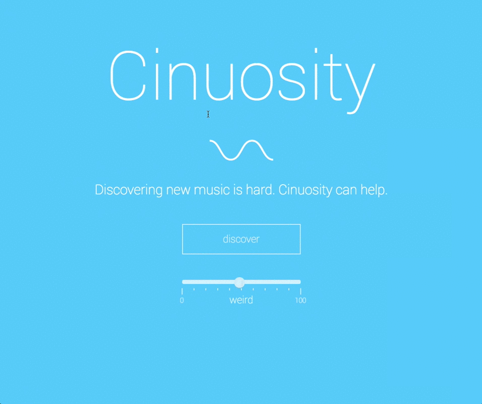

# Cinuosity
Novel playlist generation and music discovery in Spotify.

View the live site at [cinuosity.com](http://cinuosity.com).



# Overview
Spotify Discover playlists are great at giving you more music similiar to the music you already listen to, but sometimes the greatest music disoveries come from unexpected or seamingly random connections. Cinuosity helps you to discover *new* genres, styles, and artists that you haven't heard before by injecting a bit of randomness into the process. Using a large number of multilingual dictionaries, Cinuosity generates pseudorandom playlists for you to explore. 

# Setup
Clone this repo
```
git clone https://github.com/csteinmetz1/Cinuosity.git
```

Install node.js modules by running install within the new directory
```
npm install 
```

Create a keys.js file with your API app details and save it in the root directory. 
```
// Spotify API keys
module.exports = {
    client_id : 'your_client_id_here',
    client_secret : 'your_client_secret here',
    redirect_uri : 'your_callback_uri_here'
};
```

Start the server
```
node app.js
```
# References 
* [Spotify Web API documentation](https://developer.spotify.com/web-api/)
* [noUiSlider](https://refreshless.com/nouislider/)
* [Button Hover States](https://codepen.io/anon/pen/rpOmPx)